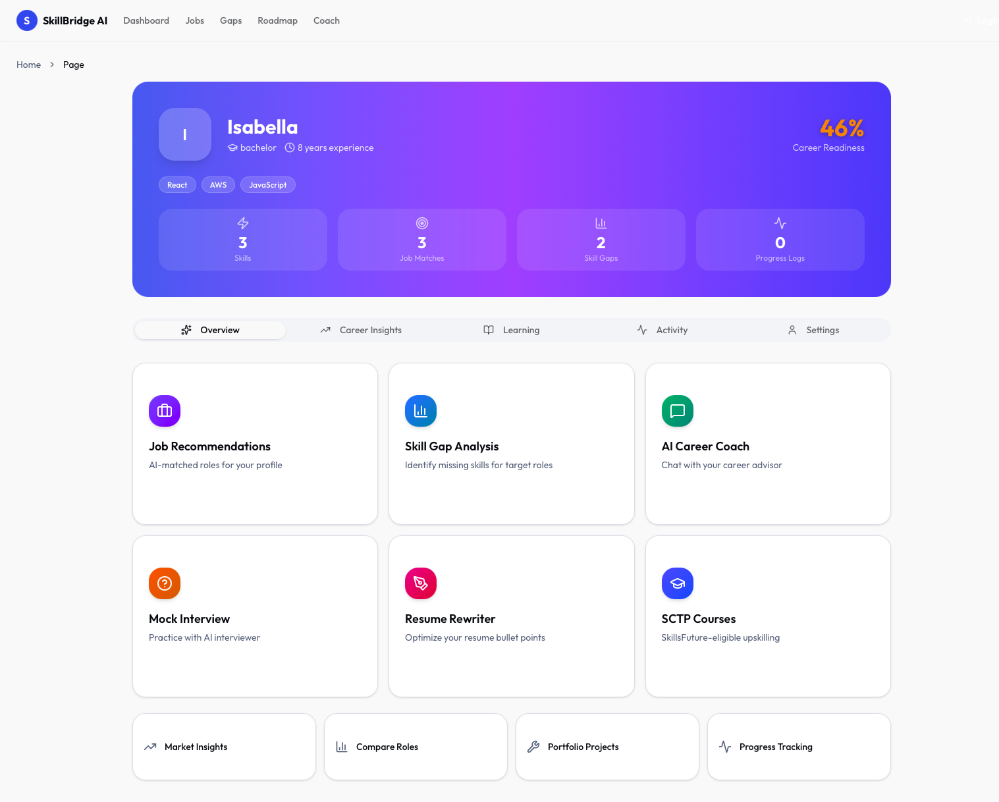
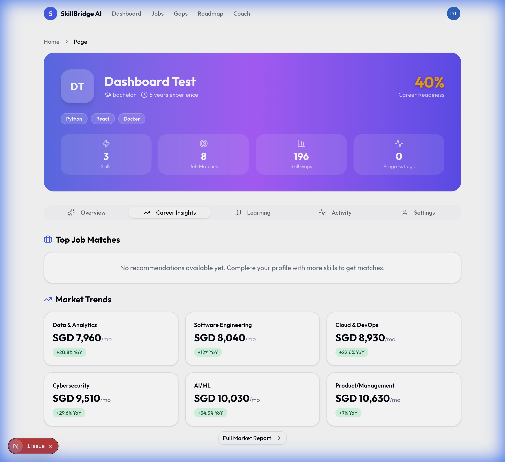
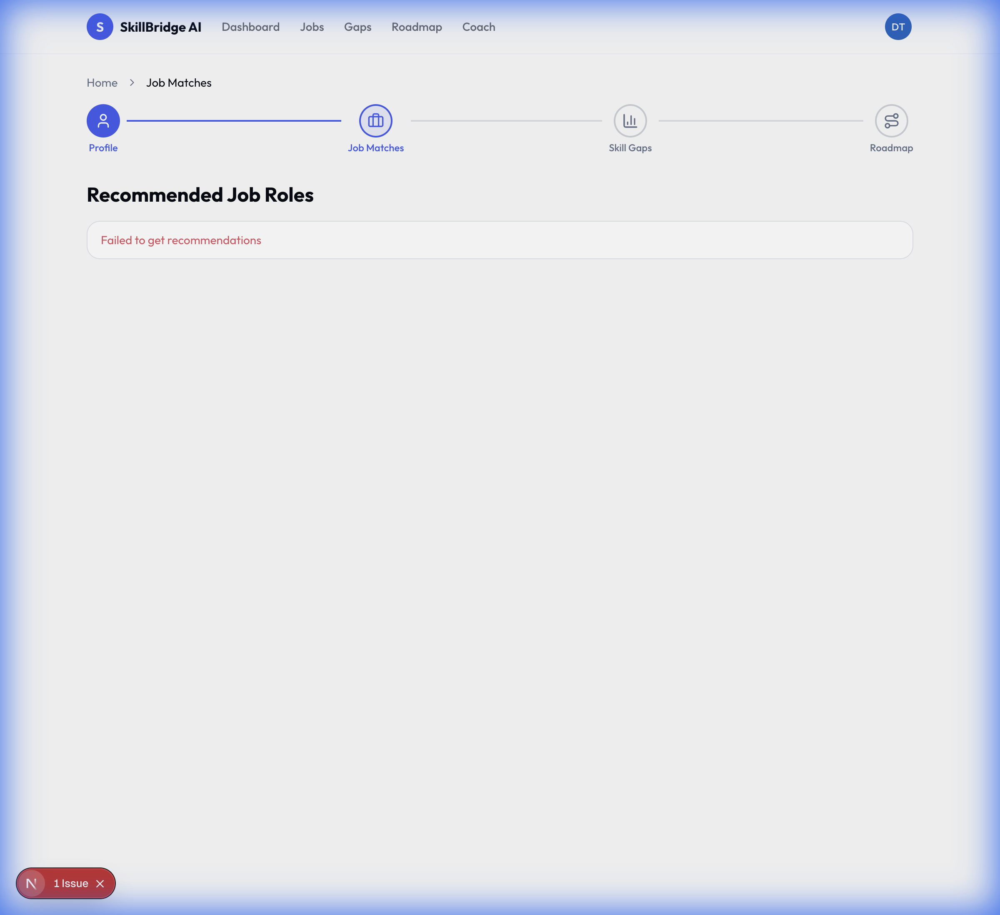
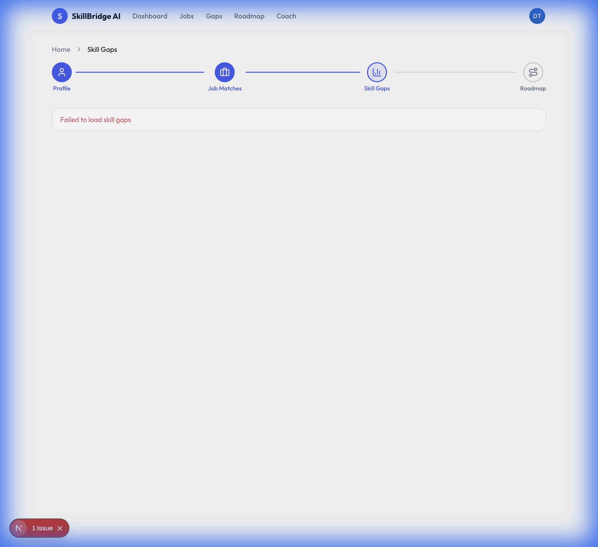
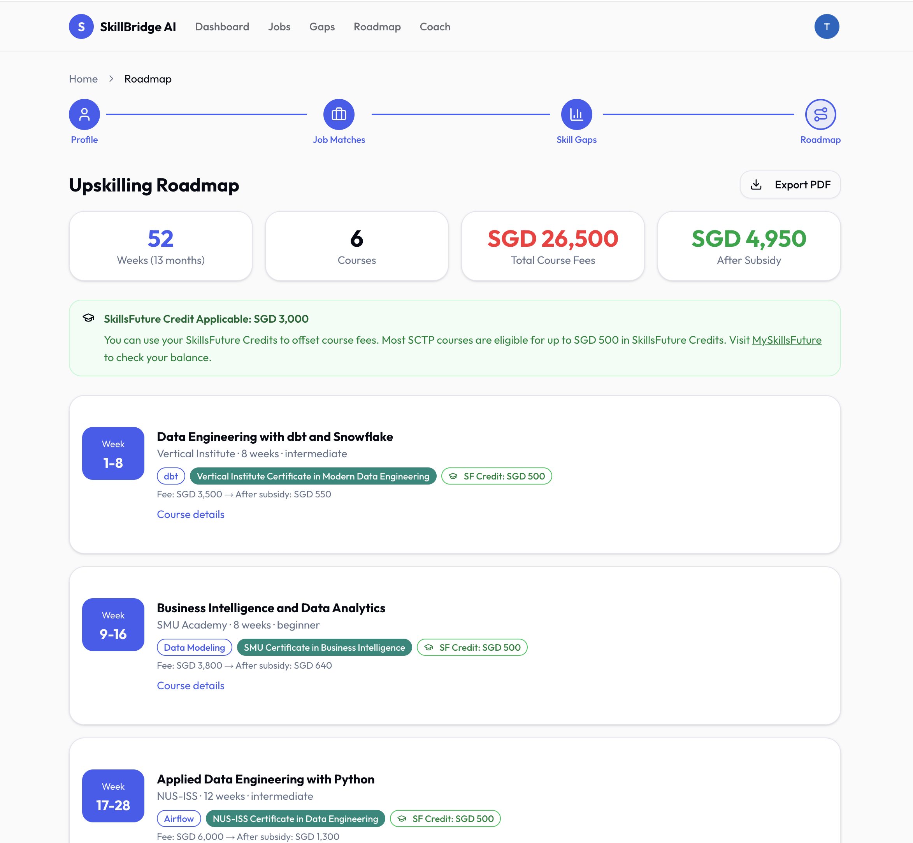
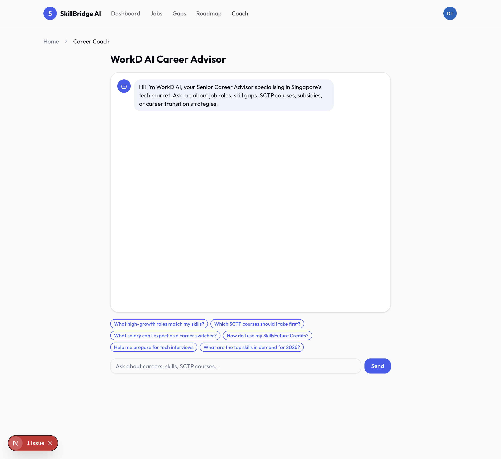

# SkillBridge AI 🚀

**AI-Driven Career Intelligence for Singapore's SCTP Learners & Career Switchers**

SkillBridge AI is a comprehensive career acceleration platform designed to bridge the gap between current skills and future-ready tech roles. Leveraging advanced AI, real-time market data, and the SkillsFuture Singapore (SSG) framework, it provides personalized upskilling pathways, job recommendations, and interactive career coaching.

---

## ✨ Key Features

### 🧠 Intelligent Analysis
- **Smart Profile Parsing**: Upload your PDF/DOCX resume for instant skill extraction using NLP (Sentence Transformers + spaCy).
- **Hybrid Job Matching**: Advanced ranking algorithm combining content similarity (60%) with rule-based heuristics (40%) to find your perfect fit.
- **Skill Gap Visualization**: Visual radar charts and detailed breakdowns of missing skills for every target role.

### 📈 Real-Time Market Insights
- **Live Market Simulator**: Tracks daily fluctuations in salary, hiring volume, and demand for Singapore's tech sector.
- **2026 Trends**: benchmarks against projected growth sectors (AI, Cybersecurity, Cloud) to guide your career decisions.

### 🎓 Personalized Learning
- **SCTP Pathways**: Automatically generates structured learning paths (Beginner → Advanced) using validated SkillsFuture Career Transition Programme courses.
- **Subsidy Calculator**: Real-time calculation of course fees, including MCES (90% subsidy for age 40+) and SkillsFuture Credit offsets.

### 🤖 AI Career Coach
- **Context-Aware Chat**: Interactive LLM chatbot that "knows" your profile, skill gaps, and local market trends.
- **Mock Interview Simulator**: Practice role-specific questions generated based on your actual weak points.
- **Resume Optimizer**: AI-powered suggestions to rewrite bullet points for maximum impact.

### ⚡ Automation & Experience
- **Seamless Onboarding**: "Guest Mode" allows instant value exploration before account creation.
- **n8n Workflows**: Automated pipelines for resume ingestion, market data updates, and notification triggers.

---

## 🛠️ Technology Stack

| Domain | Technologies |
|--------|--------------|
| **Frontend** | Next.js 16 (App Router), React 19, TypeScript, Tailwind CSS, shadcn/ui |
| **Backend** | Python 3.11, FastAPI, SQLAlchemy 2.0, Pydantic |
| **AI / ML** | PyTorch, Sentence Transformers (`all-MiniLM-L6-v2`), FAISS, Google Gemini API |
| **Database** | PostgreSQL 16 |
| **Automation**| n8n, Docker Compose |
| **DevOps** | Docker, Shell Scripts |

---

## 🚀 Getting Started

### Prerequisites
- [Docker & Docker Compose](https://www.docker.com/products/docker-desktop/)
- [Gemini API Key](https://aistudio.google.com/) (Optional, for full AI features)

### Quick Start (Docker)
The easiest way to run the full stack (Frontend, Backend, DB, Automation) is via Docker.

1. **Clone the repository**
   ```bash
   git clone https://github.com/azniosman/dsai-capstone.git
   cd dsai-capstone
   ```

2. **Configure Environment**
   ```bash
   cp .env.example .env
   # Edit .env to add your GEMINI_API_KEY
   ```

3. **Launch the Application**
   ```bash
   # Starts all services in detached mode
   bash scripts/deploy.sh
   ```

4. **Access the App**
   - **Frontend**: [http://localhost:3000](http://localhost:3000)
   - **Backend API Docs**: [http://localhost:8000/docs](http://localhost:8000/docs)
   - **n8n Automation**: [http://localhost:5678](http://localhost:5678)

---

## 💻 Development Setup

If you prefer to run services locally for development:

### Backend
```bash
cd backend
# Create environment
conda create -n skillbridge python=3.11 -y && conda activate skillbridge
pip install -r requirements.txt
python -m spacy download en_core_web_sm

# Run Server
uvicorn app.main:app --reload
```

### Frontend
```bash
cd frontend
npm install
npm run dev
# Access at http://localhost:3000
```

### Seeding Data
Populate the database with Singapore market data, job roles, and SCTP courses:
```bash
# From root directory
python data/scripts/seed_db.py
```

---

## ☁️ AWS Deployment (Terraform)

Deploy the entire stack to AWS (ECS Fargate, RDS, ALB) using Infrastructure as Code.

### Prerequisites
1. **AWS CLI**: Installed and configured with `aws configure`.
2. **Terraform**: [Install Terraform](https://developer.hashicorp.com/terraform/downloads).

### Deployment Steps

1. **Initialize Terraform**
   ```bash
   cd terraform
   terraform init
   ```

2. **Build & Push Docker Images**
   This script builds images and pushes them to Amazon ECR.
   ```bash
   # Make script executable
   chmod +x ../scripts/build_and_push.sh
   # Run build script
   ../scripts/build_and_push.sh
   ```

3. **Plan Infrastructure**
   Review changes before applying.
   ```bash
   terraform plan -out=tfplan
   ```

4. **Apply Deployment**
   Provision VPC, RDS, ECS, and Load Balancers.
   ```bash
   terraform apply tfplan
   ```

5. **Access the App**
   After deployment, Terraform will output the **Load Balancer DNS**.
   ```bash
   # Example Output
   alb_dns_name = "skillbridge-dev-alb-123456789.ap-southeast-1.elb.amazonaws.com"
   ```
   Access the app at `http://<alb_dns_name>`.

---

## 📂 Project Structure

```text
dsai-capstone/
├── backend/                # FastAPI Application
│   ├── app/
│   │   ├── routers/        # API Endpoints (Auth, Market, Jobs, AI)
│   │   ├── services/       # Business Logic (Pathways, Simulator)
│   │   ├── models/         # SQLAlchemy ORM Models
│   │   └── ml/             # AI Models (FAISS, Embeddings)
├── frontend/               # Next.js Application
│   ├── app/                # App Router Pages
│   └── components/         # Reusable UI Components
├── n8n/                    # Automation Workflows
│   └── workflows/          # JSON Workflow exports
├── data/                   # Seed Data & Scripts
└── docker-compose.yml      # Container Orchestration
```

---

## 🛡️ Configuration

Create a `.env` file in the root directory:

```ini
# Core
ENVIRONMENT=development
SECRET_KEY=your_secure_random_key_here

# Database
POSTGRES_USER=capstone
POSTGRES_PASSWORD=changeme
POSTGRES_DB=capstone
DATABASE_URL=postgresql://capstone:changeme@db:5432/capstone

# AI Services
GEMINI_API_KEY=AIzaSy...
GEMINI_MODEL=gemini-2.0-flash
SENTENCE_TRANSFORMER_MODEL=all-MiniLM-L6-v2
```

---

## 📸 Screenshots


### 📊 Dashboard & Insights
| Profile Dashboard | Market Trends |
|-------------------|---------------|
|  |  |

### 🚀 Career Growth
| Job Recommendations | Skill Gap Analysis |
|---------------------|--------------------|
|  |  |

### 🎓 Learning & Coaching
| Personalized Roadmap | AI Career Coach |
|----------------------|-----------------|
|  |  |

---

## 📄 License

Distributed under the MIT License. See `LICENSE` for more information.

---

**SkillBridge AI** — Empowering Singapore's Workforce 🇸🇬