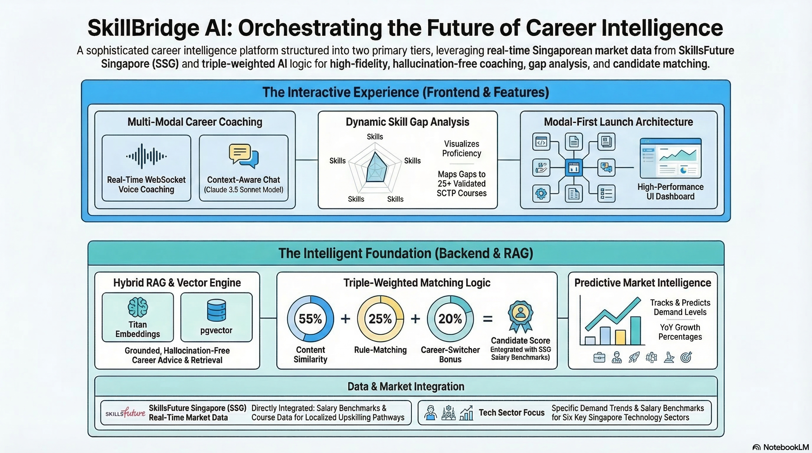
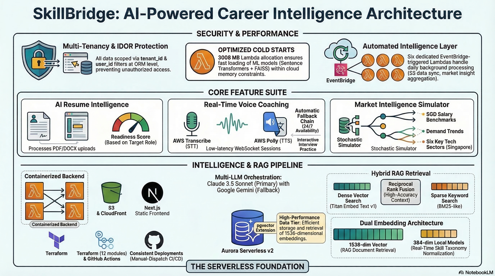
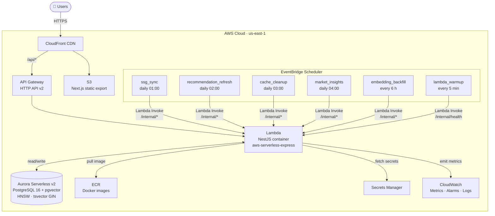

# SkillBridge

**AI-Powered Career Intelligence Platform for Singapore's SCTP Learners & Career Switchers**

SkillBridge is a serverless, full-stack AI platform that helps SCTP learners and mid-career professionals navigate Singapore's evolving tech job market. It combines a six-phase hybrid Retrieval-Augmented Generation (RAG) pipeline, multi-provider LLM orchestration, and an interactive AI career coach — all grounded in real SkillsFuture course data, SSG/WSG salary benchmarks, and live market intelligence.




**Enterprise Roadmap:** See [Enterprise-Technical_Roadmap.md](Enterprise-Technical_Roadmap.md)

---

## Table of Contents

1. [Architecture Overview](#architecture-overview)
2. [Technology Stack](#technology-stack)
3. [AI & RAG Pipeline](#ai--rag-pipeline)
4. [LLM Model Configuration](#llm-model-configuration)
5. [EventBridge Automation Layer](#eventbridge-automation-layer)
6. [Features](#features)
7. [Deployment](#deployment)
8. [Local Development](#local-development)
9. [Environment Variables](#environment-variables)
10. [API Reference](#api-reference)
11. [Security](#security)
12. [Project Structure](#project-structure)
13. [Future Roadmap](#future-roadmap)

---

## Architecture Overview

SkillBridge is deployed on AWS serverless infrastructure. The backend is a **containerized NestJS application** running on AWS Lambda via the `aws-serverless-express` adapter, exposed through API Gateway HTTP API v2. The frontend is a **Next.js static export** served from S3 + CloudFront. An **EventBridge Scheduler automation layer** handles all background processing — cache warming, SSG data sync, embedding backfill, and AI pre-computation — without any always-on infrastructure.


```mermaid
graph TD
    User(["👤 Users"])

    subgraph AWS["AWS Cloud · us-east-1"]
        CF["CloudFront CDN"]
        S3["S3\nNext.js static export"]
        APIGW["API Gateway\nHTTP API v2"]
        Lambda["Lambda\nNestJS container\naws-serverless-express"]
        Aurora[("Aurora Serverless v2\nPostgreSQL 16 + pgvector\nHNSW · tsvector GIN")]
        ECR["ECR\nDocker images"]
        SM["Secrets Manager"]
        CW["CloudWatch\nMetrics · Alarms · Logs"]

        subgraph EB["EventBridge Scheduler"]
            SSG["ssg_sync\ndaily 01:00"]
            REC["recommendation_refresh\ndaily 02:00"]
            CACHE["cache_cleanup\ndaily 03:00"]
            MKT["market_insights\ndaily 04:00"]
            EMB["embedding_backfill\nevery 6 h"]
            WARM["lambda_warmup\nevery 5 min"]
        end
    end

    User -->|HTTPS| CF
    CF --> S3
    CF -->|"/api/*"| APIGW
    APIGW --> Lambda
    Lambda <-->|read/write| Aurora
    Lambda -->|pull image| ECR
    Lambda -->|fetch secrets| SM
    Lambda -->|emit metrics| CW

    SSG -->|Lambda Invoke\n/internal/*| Lambda
    REC -->|Lambda Invoke\n/internal/*| Lambda
    CACHE -->|Lambda Invoke\n/internal/*| Lambda
    MKT -->|Lambda Invoke\n/internal/*| Lambda
    EMB -->|Lambda Invoke\n/internal/*| Lambda
    WARM -->|Lambda Invoke\n/internal/health| Lambda
```

**Schema lifecycle**: On every Lambda cold start, `orm.getSchemaGenerator().updateSchema()` runs automatically. This is additive-only — it adds missing tables and columns but never drops anything, making it safe for zero-downtime Lambda deployments.

---

## Technology Stack

### Backend

| Layer            | Technology                                                                                                            |
| ---------------- | --------------------------------------------------------------------------------------------------------------------- |
| Runtime          | NestJS 11 + TypeScript 5.7                                                                                            |
| ORM              | MikroORM 6 (PostgreSQL driver)                                                                                        |
| Database         | PostgreSQL 16 + pgvector extension                                                                                    |
| Vector index     | HNSW (`vector_cosine_ops`) + tsvector GIN                                                                             |
| Auth             | Passport.js — JWT + Local + LinkedIn OAuth strategies                                                                 |
| Embedding model  | `Xenova/bge-small-en-v1.5` (ONNX, 384-dim, runs in-process)                                                        |
| Re-ranking model | `Xenova/ms-marco-MiniLM-L-6-v2` (cross-encoder, optional)                                                          |
| LLM providers    | Groq (`llama-3.3-70b-versatile`), Anthropic Claude (`claude-sonnet-4-6`), Google Gemini (`gemini-2.0-flash`)        |
| File parsing     | `pdf-parse` (PDF), `mammoth` (DOCX)                                                                                   |
| Validation       | `class-validator` + `class-transformer`                                                                               |

### Frontend

| Layer         | Technology                                     |
| ------------- | ---------------------------------------------- |
| Framework     | Next.js 16 (App Router) + React 19 (PWA-enabled) |
| Language      | TypeScript 5                                     |
| Styling       | Tailwind CSS 4 + shadcn/ui (New York style) + dark mode |
| State         | Zustand 5 (modal store, profile builder store) |
| Data fetching | TanStack Query v5 (React Query)                |
| Charts        | Recharts 3                                     |
| Animation     | Framer Motion 12                               |
| 3D            | Three.js (landing page)                        |
| Diagramming   | React Flow (architecture diagram)              |
| HTTP client   | Axios (auto JWT attach + 401 refresh)          |

### Infrastructure

| Layer               | Technology                                      |
| ------------------- | ----------------------------------------------- |
| Compute             | AWS Lambda (containerized NestJS)               |
| API                 | API Gateway HTTP API v2                         |
| Database            | Aurora Serverless v2 (PostgreSQL 16 compatible) |
| CDN / Frontend      | S3 + CloudFront                                 |
| Registry            | Amazon ECR                                      |
| Automation          | EventBridge Scheduler + Python Lambda functions |
| Monitoring          | CloudWatch (EMF metrics, dashboards, alarms)    |
| Secrets             | AWS Secrets Manager                             |
| IaC                 | Terraform 1.9                                   |
| CI/CD               | GitHub Actions (manual dispatch)                |
| Local dev           | Docker Compose                                  |
| Workflow automation | n8n                                             |

---

## AI & RAG Pipeline

SkillBridge implements a **Hybrid RAG** pipeline with six progressive phases, culminating in a single-trip SQL CTE with cross-encoder re-ranking.

### RAG Retrieval Pipeline

```
User query
    │
    ▼
EmbeddingService.embed(query)
  └─ ONNX pipeline: Xenova/bge-small-en-v1.5 (384-dim, in-process)
    │
    ▼
Single SQL CTE (one DB round trip)
  ├─ semantic branch: pgvector HNSW cosine similarity (embedding <=> query)
  └─ keyword branch: tsvector GIN full-text (plainto_tsquery('english', query))
                     FULL OUTER JOIN → Reciprocal Rank Fusion (k=60)
    │
    ▼
applyFeedbackBoost()  [authenticated users only]
  └─ rrfScore += 0.01 × tanh(net_votes)  [from rag_feedback table]
    │
    ▼
CrossEncoderService.rerank()  [optional, RERANKER_ENABLED=true]
  └─ ONNX pipeline: Xenova/ms-marco-MiniLM-L-6-v2 (top-20 candidates)
    │
    ▼
Top-K chunks → LLM context augmentation → response
```

**Degradation chain**: If the hybrid CTE fails (e.g., `search_vector` column absent on a fresh DB), the service automatically falls back to semantic-only retrieval. If the cross-encoder fails, the RRF order is preserved unchanged.

### Document Ingestion

```
Resume / document upload (PDF or DOCX)
    │
    ▼ pdf-parse / mammoth
Raw text
    │
    ▼ RagService.splitText()
Overlapping chunks (1,500 chars, 200-char overlap, sentence-boundary aware)
    │
    ▼ SHA-256 hash check (idempotent — skips already-stored chunks)
    │
    ▼ EmbeddingService.embed()
384-dim vectors → stored in document_chunk (pgvector column)
```

**Embedding model note**: `Xenova/bge-small-en-v1.5` is baked into the Docker image at build time via `scripts/download-model.cjs`. `EmbeddingService` sets `allowRemoteModels=false` in production — the model must be present in `/app/.cache/huggingface` or the service will log an error at startup.

```
```

### Hybrid Scoring (Job Recommendations)

The intelligence layer uses a weighted scoring formula separate from RAG retrieval:

```
final_score = 0.55 × content_similarity
            + 0.25 × rule_match
            + 0.20 × career_switcher_bonus
```

Skill levels: `0.0` (missing) · `0.5` (partial) · `1.0` (strong)

### RAG Type

This is **Hybrid RAG** — combining dense vector search (HNSW cosine) with sparse keyword search (BM25-like tsvector GIN) via Reciprocal Rank Fusion, augmented with feedback-weighted re-ranking and an optional cross-encoder re-ranker.

---

## LLM Model Configuration

LLM providers are configured entirely through environment variables. The service tries providers in order and falls back automatically.

```bash
# Provider dispatch order (default: groq → claude → gemini)
PRIMARY_LLM=groq
SECONDARY_LLM=claude
TERTIARY_LLM=gemini

# Groq (primary — fastest, free tier available)
GROQ_API_KEY=gsk_...
GROQ_MODEL=llama-3.3-70b-versatile

# Anthropic Claude (secondary fallback)
ANTHROPIC_API_KEY=sk-ant-...
CLAUDE_MODEL=claude-sonnet-4-6

# Google Gemini (tertiary fallback)
GEMINI_API_KEY=AIza...
GEMINI_MODEL=gemini-2.0-flash

# Shared generation parameters
AI_TEMPERATURE=0.3
AI_MAX_TOKENS=2048
```

**Fallback behaviour**: Each provider is attempted in order. If a provider throws (rate limit, API error, missing key), the next one is tried. If all fail, the endpoint returns HTTP 503. Unconfigured providers are skipped entirely — you only need to set the keys for providers you want to use. At minimum, configure one.

**Engine reporting**: Every LLM response includes an `engine` field (e.g., `"groq"`, `"claude"`, `"gemini"`) so the UI can display which provider served the request.

---

## EventBridge Automation Layer

Six Python Lambda functions triggered by EventBridge Scheduler handle all background processing. They communicate with the NestJS backend exclusively via Lambda Invoke API (not HTTP), calling `/internal/*` endpoints that are not exposed on API Gateway.

| Function                 | Schedule (UTC)      | Purpose                                                          |
| ------------------------ | ------------------- | ---------------------------------------------------------------- |
| `ssg_sync`               | Daily 01:00 / 01:30 | Sync SSG courses and WSG job roles into PostgreSQL cache         |
| `recommendation_refresh` | Daily 02:00 / 02:30 | Pre-compute recommendation scores (Phase 2 stub)                 |
| `cache_cleanup`          | Daily 03:00         | Bulk-delete expired `ssg_cache` rows                             |
| `market_insights`        | Daily 04:00         | Aggregate market insight metrics                                 |
| `embedding_backfill`     | Every 6 hours       | ONNX embedding backfill for NULL-embedding chunks (Phase 2 stub) |
| `lambda_warmup`          | Every 5 minutes     | Keep-alive ping to prevent cold starts                           |

All automation functions share `base_automation.py` for token retrieval (from Secrets Manager), Lambda Invoke construction, and CloudWatch EMF metric emission. The `INTERNAL_AUTOMATION_TOKEN` is cached in module scope across warm invocations.

---

## Features

### Core User Features

- **Job Recommendations** — Hybrid scoring matches user profile skills against Singapore tech roles with AI-generated rationale per recommendation
- **Skill Gap Analysis** — Identifies missing and partial skills for a target role with severity classification (critical / high / medium)
- **Upskilling Roadmap** — Personalised learning path with SCTP course recommendations and AI-generated motivational narrative
- **JD Match** — Paste any job description to get skill extraction, match score, and gap analysis in seconds
- **AI Career Copilot (Dossier)** — Centralized career intelligence profile with multi-turn chat, data extraction, and quick actions (Groq → Claude → Gemini fallback)
- **Trace Activity Timeline (Logs)** — Real-time observability dashboard for tracking RAG pipeline execution steps and system-wide telemetry
- **Interview Preparation** — AI-generated role-specific practice questions
- **Resume Upload & Parsing** — PDF and DOCX parsing with LLM-assisted structured extraction (name, email, skills, experience years)
- **Resume Rewriter** — AI rewrites individual resume bullet points optimised for a target role
- **SkillsFuture Course Catalog** — Searchable SCTP course listings with subsidy calculator and three-tier data fallback (live SSG API → PostgreSQL cache → seeded data)
- **Market Insights** — Singapore labor market data: sector demand, salary benchmarks, skill trends
- **Role Comparison** — Side-by-side comparison of up to multiple target roles
- **Skill Progress Tracking** — Record skill advancement over time with dashboard visualisation
- **Course Enrollment & Achievements** — Enroll in SCTP courses, track completion, earn gamified achievements; progress summary dashboard
- **Interview Preparation Bot** — Structured AI mock interview sessions with turn-by-turn history persisted to `interview_session` / `interview_turn` entities
- **Job Alerts** — Subscribe to role-specific job alerts; notifications delivered via `notification` entity
- **Live Infocomm Job Matrix** — Real-time Singapore job matrix view backed by the data-intelligence pipeline (dataset versioning, diff tracking, trend signals)
- **Dashboard** — Career health score, KPI tiles, opportunity feed, and growth vectors

### Account & Compliance Features

- **LinkedIn OAuth** — One-click sign-in via LinkedIn; auto-creates user + pre-fills profile from LinkedIn data via `LinkedInImportService`
- **GDPR/PDPA Consent Management** — Full consent audit trail (`consent_record` entity); supports data export and right-to-erasure (`DELETE /api/consent/erase`, `DELETE /api/auth/me`)
- **Dark Mode** — System-aware theme toggle persisted via `ThemeProvider`
- **PWA** — Installable as a Progressive Web App with offline shell caching

### Platform Features

- **Multi-tenancy** — All entities scoped to tenant; Global tenant (ID 1) is the default for unauthenticated requests
- **Optional authentication** — Core features (recommendations, skill gap, chat, JD match) work without login via `OptionalJwtAuthGuard`; personalised RAG re-ranking and feedback require a JWT
- **RAG feedback loop** — Thumbs-up / thumbs-down on retrieved document chunks; signals feed back into future retrieval scoring
- **Recommendation cache** — In-memory TTL cache (300 s) for recommendation results
- **SSG integration** — Live SkillsFuture/WSG API with PostgreSQL caching; falls back to seeded SCTP data when credentials are absent

---

## Deployment

### AWS Serverless (Production)

The production stack runs entirely on serverless AWS infrastructure managed by Terraform.

```bash
# Quick redeploy — image rebuild + frontend only (~5 min)
# Use after code-only changes; preserves existing API Gateway URL and S3 bucket
gh workflow run deploy-serverless.yml -f environment=dev -f skip_terraform=true

# Full deploy — clean teardown + Terraform apply (~35 min)
# Required for infrastructure changes; API Gateway URL and S3 bucket name change
gh workflow run deploy-serverless.yml -f environment=dev

# Full deploy with custom domain (HTTP only)
gh workflow run deploy-serverless.yml \
  -f environment=dev \
  -f enable_custom_domain=true \
  -f custom_domain=sklbr.co

# Full deploy with custom domain + HTTPS (CloudFront required for HTTPS)
gh workflow run deploy-serverless.yml \
  -f environment=dev \
  -f enable_cloudfront=true \
  -f enable_custom_domain=true \
  -f custom_domain=sklbr.co

# Get the deployed API endpoint
cd terraform && terraform output -raw api_endpoint

# Pause NAT Gateway between demos (saves ~$32/month)
terraform destroy \
  -target='module.vpc.aws_nat_gateway.main' \
  -target='module.vpc.aws_eip.nat'
```

**Infrastructure components provisioned by Terraform:**

- VPC with public/private subnets + NAT Gateway
- ECR repository for Docker images
- Aurora Serverless v2 cluster (PostgreSQL 16 + pgvector)
- Lambda function (NestJS container) + API Gateway HTTP API v2
- S3 bucket (frontend static export) + optional CloudFront distribution
- EventBridge Scheduler rules for 6 automation functions + SQS DLQ + SNS alerts
- CloudWatch dashboard + 6 alarms (Lambda errors, throttles, DB connections, p95 latency)
- Secrets Manager secrets for DB credentials and internal token
- IAM roles with least-privilege policies

**CI/CD**: GitHub Actions workflow (`.github/workflows/deploy-serverless.yml`). Manual dispatch only — triggered from GitHub Actions UI. Requires `AWS_ACCESS_KEY_ID` and `AWS_SECRET_ACCESS_KEY` in the target GitHub environment (`dev` or `prod`). Targets `us-east-1`.

### Lambda Deployment Notes

- **`update-function-code` is not instant**: Warm containers may serve old code for 1–2 minutes after update. Send a few test requests to exhaust the warm pool before smoke-testing.
- **Docker buildx**: Always pass `--provenance=false` to `docker buildx build`. Without it, BuildKit adds SLSA attestations that Lambda rejects with `InvalidParameterValueException`.
- **Aurora password**: Must not contain `/`, `@`, `"`, or spaces. The CI workflow strips these automatically; local `.env` files must comply.
- **`/internal/*` endpoints**: Not exposed on API Gateway. Automation Lambdas call them via Lambda Invoke API only. `InternalTokenGuard` is a second layer of defence.

---

## Local Development

### Prerequisites

- Docker + Docker Compose
- Node.js 20+
- An `.env` file at the project root (see [Environment Variables](#environment-variables))

### Start the Full Stack

```bash
# Start all services: PostgreSQL (:5432), backend (:8000), frontend (:3000), n8n (:5678)
docker compose up
```

On first start, the backend automatically:

1. Enables the `pgvector` extension
2. Creates/updates the schema (additive-only)
3. Adds HNSW and GIN indexes
4. Seeds reference data (skills taxonomy, job roles, SCTP courses)

### Backend Development (without Docker)

```bash
cd nestjs-backend
npm install
npm run start:dev       # watch mode on :8000
npm run start:debug     # watch mode with Node inspector
npm run build           # compile TypeScript to dist/
npm run lint            # ESLint
npm run format          # Prettier
npm run test            # unit tests (Jest)
npm run test:cov        # coverage report
npm test -- --testPathPatterns="rag.service"   # run a single spec file
```

### Frontend Development

```bash
cd frontend
npm install
npm run dev     # dev server on :3000 (proxies /api/* → localhost:8000)
npm run build   # production build — must pass before any PR
npm run lint    # ESLint
```

### Database Seeding (manual)

```bash
cd nestjs-backend
npx mikro-orm seeder:run
```

---

## Environment Variables

Create a `.env` file at the project root. See `.env.example` for a complete template.

### Database

| Variable            | Default     | Description                                                 |
| ------------------- | ----------- | ----------------------------------------------------------- |
| `DATABASE_URL`      | —           | Full Postgres connection string (overrides individual vars) |
| `DATABASE_USER`     | `capstone`  | PostgreSQL username                                         |
| `DATABASE_PASSWORD` | `changeme`  | PostgreSQL password                                         |
| `DATABASE_HOST`     | `localhost` | PostgreSQL host                                             |
| `DATABASE_PORT`     | `5432`      | PostgreSQL port                                             |
| `DATABASE_NAME`     | `capstone`  | Database name                                               |

### Auth & Backend

| Variable                    | Default                                             | Description                                                                  |
| --------------------------- | --------------------------------------------------- | ---------------------------------------------------------------------------- |
| `JWT_SECRET`                | —                                                   | JWT signing key (required)                                                   |
| `CORS_ALLOWED_ORIGINS`      | `["http://localhost:3000","http://localhost:5173"]` | Allowed origins (JSON array or comma-separated)                              |
| `INTERNAL_AUTOMATION_TOKEN` | —                                                   | Shared secret for `/internal/*` endpoints; validated by `InternalTokenGuard` |

### LLM Providers

| Variable            | Default                   | Description                                            |
| ------------------- | ------------------------- | ------------------------------------------------------ |
| `PRIMARY_LLM`       | `groq`                    | First provider to attempt (`groq \| claude \| gemini`) |
| `SECONDARY_LLM`     | `claude`                  | Second provider                                        |
| `TERTIARY_LLM`      | `gemini`                  | Third provider                                         |
| `GROQ_API_KEY`      | —                         | Groq API key                                           |
| `GROQ_MODEL`        | `llama-3.3-70b-versatile` | Groq model ID                                          |
| `ANTHROPIC_API_KEY` | —                         | Anthropic API key                                      |
| `CLAUDE_MODEL`      | `claude-sonnet-4-6`       | Claude model ID                                        |
| `GEMINI_API_KEY`    | —                         | Google Gemini API key                                  |
| `GEMINI_MODEL`      | `gemini-2.0-flash`        | Gemini model ID                                        |
| `AI_TEMPERATURE`    | `0.3`                     | Sampling temperature (all providers)                   |
| `AI_MAX_TOKENS`     | `2048`                    | Max output tokens (all providers)                      |

### Embedding & RAG

| Variable             | Default                         | Description                                                      |
| -------------------- | ------------------------------- | ---------------------------------------------------------------- |
| `EMBEDDING_MODEL`    | `Xenova/bge-small-en-v1.5`      | ONNX sentence embedding model (384-dim); baked into Docker image |
| `RERANKER_ENABLED`   | `false`                         | Set `true` to activate cross-encoder re-ranking                  |
| `RERANKER_MODEL`     | `Xenova/ms-marco-MiniLM-L-6-v2` | Cross-encoder model                                              |
| `RERANKER_TOP_N`     | `20`                            | Number of RRF candidates to score with cross-encoder             |
| `TRANSFORMERS_CACHE` | `.cache/huggingface`            | Model cache directory (use `/tmp/.transformers_cache` on Lambda) |

### SSG / SkillsFuture Integration

| Variable                | Default                          | Description                                                   |
| ----------------------- | -------------------------------- | ------------------------------------------------------------- |
| `SSG_CLIENT_ID`         | —                                | SSG/WSG OAuth client ID (optional; falls back to seeded data) |
| `SSG_CLIENT_SECRET`     | —                                | SSG/WSG OAuth client secret                                   |
| `SSG_API_BASE_URL`      | `https://uat-api.ssg-wsg.gov.sg` | SSG API base URL                                              |
| `SSG_TOKEN_URL`         | —                                | SSG OAuth token endpoint                                      |
| `SSG_CACHE_TTL_SECONDS` | `3600`                           | How long to cache SSG responses in PostgreSQL                 |

### Frontend

| Variable              | Description                                                  |
| --------------------- | ------------------------------------------------------------ |
| `NEXT_PUBLIC_API_URL` | Backend URL (default: `http://localhost:8000`)               |
| `NEXT_OUTPUT`         | Set to `export` for S3 static export (disables API rewrites) |

---

## API Reference

### Public Endpoints

| Method | Path                          | Description                                               |
| ------ | ----------------------------- | --------------------------------------------------------- |
| `POST`   | `/api/auth/register`          | User registration                                         |
| `POST`   | `/api/auth/login`             | Login → returns JWT                                       |
| `GET`    | `/api/auth/me`                | Current user info                                         |
| `PATCH`  | `/api/auth/me`                | Update account (email, display name)                      |
| `DELETE` | `/api/auth/me`                | Delete account (GDPR/PDPA right to erasure)               |
| `POST`   | `/api/auth/change-password`   | Change password                                           |
| `POST`   | `/api/auth/logout`            | Invalidate refresh token                                  |
| `POST`   | `/api/auth/refresh`           | Refresh JWT access token                                  |
| `GET`    | `/api/auth/linkedin`          | Initiate LinkedIn OAuth flow                              |
| `GET`    | `/api/auth/linkedin/callback` | LinkedIn OAuth callback                                   |
| `GET`    | `/api/auth/linkedin/preview`  | Preview LinkedIn profile before import                    |
| `POST`   | `/api/consent`                | Record GDPR/PDPA consent                                  |
| `GET`    | `/api/consent`                | Get current consent status                                |
| `GET`    | `/api/consent/history`        | Full consent audit trail                                  |
| `GET`    | `/api/consent/export`         | Export personal data (PDPA data portability)              |
| `DELETE` | `/api/consent/erase`          | Erase personal data (PDPA right to erasure)               |
| `POST`   | `/api/profile`                | Create user profile                                       |
| `POST` | `/api/upload-resume`          | Upload PDF/DOCX resume for parsing                        |
| `POST`   | `/api/recommend`              | Get job recommendations (auth optional)                   |
| `GET`    | `/api/skill-gap/{id}`         | Skill gap analysis for a role                             |
| `GET`    | `/api/upskilling/{id}`        | Upskilling roadmap for a role                             |
| `POST`   | `/api/jd-match`               | Match profile against job description (auth optional)     |
| `POST`   | `/api/chat`                   | Career coach chat — returns `{ reply, engine }` JSON      |
| `GET`    | `/api/market-insights`        | Singapore labor market data                               |
| `POST`   | `/api/compare-roles`          | Multi-role comparison                                     |
| `GET`    | `/api/roles`                  | List all job roles                                        |
| `POST`   | `/api/progress`                              | Record skill progress                   |
| `GET`    | `/api/progress/{id}`                         | Progress dashboard                      |
| `GET`    | `/api/progress/{id}/timeline`                | Progress timeline                       |
| `POST`   | `/api/progress/enroll`                       | Enroll in a course                      |
| `PATCH`  | `/api/progress/enrollment/{id}/progress`     | Update course progress                  |
| `PATCH`  | `/api/progress/enrollment/{id}/complete`     | Mark course complete                    |
| `GET`    | `/api/progress/enrollments`                  | List all enrollments                    |
| `GET`    | `/api/progress/summary`                      | Gamified progress summary               |
| `GET`    | `/api/progress/achievements`                 | List earned achievements                |
| `GET`    | `/api/progress/achievement-summary`          | Achievement statistics                  |
| `GET`    | `/api/courses`                | List SCTP courses                                         |
| `POST`   | `/api/calculate-subsidy`      | Calculate SkillsFuture subsidy                            |
| `POST`   | `/api/rag/query`              | Hybrid RAG retrieval (pgvector HNSW + tsvector GIN + RRF) |
| `POST`   | `/api/rag/feedback`           | Submit thumbs-up/down for a retrieved chunk               |
| `GET`    | `/api/dashboard/summary`      | Authenticated user's dashboard KPIs                       |
| `POST`   | `/api/resume-rewriter`        | AI-rewrite a resume bullet for a target role              |
| `GET`    | `/api/ssg/courses/search`     | Search SkillsFuture courses (paginated)                   |
| `GET`    | `/api/ssg/courses/:ref`       | Get a single SSG course by reference number               |
| `GET`    | `/api/ssg/job-roles`          | List WSG SkillsFramework job roles                        |
| `POST`   | `/api/ssg/recommendations`    | Personalised SSG courses by skill overlap                 |
| `POST`   | `/api/interview`              | AI mock interview session                                 |
| `POST`   | `/api/copilot/extract`        | Extract career profile from free text                     |
| `POST`   | `/api/copilot/chat`           | Multi-turn AI career copilot chat                         |
| `GET`    | `/api/copilot/analyze/:id`    | Full career analysis for a profile                        |
| `POST`   | `/api/copilot/career-plan`    | Generate personalised career plan                         |
| `POST`   | `/api/copilot/resume-tips`    | Get resume improvement tips                               |
| `GET`  | `/api/logs/recent`            | Last N structured log entries — JSON polling              |
| `GET`  | `/api/logs/stream`            | Live log stream (SSE)                                     |
| `GET`  | `/api/live-matrix`            | Infocomm job matrix (live dataset)                        |
| `GET`  | `/api/datasets`               | List ingested datasets + versions                         |
| `GET`  | `/api/dataset-diff`           | Diff between two dataset versions                         |
| `GET`  | `/api/trends`                 | Aggregated trend signals                                  |
| `POST` | `/api/system-chat`            | System-level chat for copilot and internal extraction     |

### Internal Automation Endpoints

These are accessed via Lambda Invoke API only — not exposed on API Gateway. All require the `X-Internal-Token` header (except health check).

| Method | Path                                         | Description                        |
| ------ | -------------------------------------------- | ---------------------------------- |
| `GET`  | `/internal/health`                           | Keep-alive health check (no auth)  |
| `POST` | `/internal/sync/ssg/courses`                 | Populate SSG course cache          |
| `POST` | `/internal/sync/ssg/jobroles`                | Populate SSG job role cache        |
| `POST` | `/internal/cache/cleanup`                    | Delete expired `ssg_cache` rows    |
| `POST` | `/internal/recommendations/precompute`       | Pre-compute recommendation scores  |
| `POST` | `/internal/recommendations/rationale-pregen` | Pre-generate LLM rationale         |
| `POST` | `/internal/embeddings/backfill`              | Re-embed NULL-embedding chunks     |
| `POST` | `/internal/analytics/aggregate`              | Pre-compute market insight metrics |

**Chat note**: `POST /api/chat` returns `{ reply: string, engine: string }` JSON — not a server-sent events stream. The `engine` field identifies which LLM provider served the request.

---

## Security

- **JWT authentication**: Signed tokens with configurable secret via `JWT_SECRET`. Core endpoints use `OptionalJwtAuthGuard` to allow unauthenticated access while still personalising responses when a valid token is present.
- **LinkedIn OAuth**: Passport.js `LinkedInStrategy` with server-side callback; profile data is imported once on first login and never stored beyond what the user consents to.
- **GDPR/PDPA compliance**: Full consent audit trail via `consent_record` entity. Users can export their data (`GET /api/consent/export`) or trigger erasure (`DELETE /api/consent/erase`, `DELETE /api/auth/me`) which cascades deletion across all personal data tables.
- **Password hashing**: bcrypt (cost factor default from library) for all stored credentials.
- **Internal endpoint isolation**: `/internal/*` routes are not registered on API Gateway. The `InternalTokenGuard` validates the `X-Internal-Token` header as a second layer of defence, but the primary guard is the absence of a public route.
- **Input validation**: All request bodies validated with `class-validator` + `whitelist: true, forbidNonWhitelisted: true`. No extra fields reach controllers.
- **CORS**: Configurable allowed origins via `CORS_ALLOWED_ORIGINS`. Credentials-aware.
- **Secrets management**: Production secrets (DB credentials, internal token, API keys) stored in AWS Secrets Manager; never in environment files in production.
- **Least-privilege IAM**: Lambda execution roles use scoped policies per resource. No wildcard `*` permissions in production.
- **SQL injection prevention**: All database queries use MikroORM's parameterised query builder. The two raw SQL queries in `RagService` use positional parameters (`$1`, `$2`, ...) — never string concatenation.
- **Schema safety**: `updateSchema()` is additive-only — it never drops tables or columns, preventing accidental data loss on cold start.

---

## Project Structure

```
dsai-capstone/
├── nestjs-backend/              # NestJS API (TypeScript)
│   └── src/
│       ├── auth/                # JWT + Local Passport strategies
│       ├── users/               # User CRUD
│       ├── profile/             # User profile management
│       ├── skills/              # Skill taxonomy + user skills
│       ├── intelligence/        # AI features: chat, recommendations, skill gap,
│       │                        #   interview, JD match, resume rewriter
│       │   ├── llm.service.ts   # Multi-provider LLM router (Groq → Claude → Gemini)
│       │   └── providers/       # GroqProvider, ClaudeProvider, GeminiProvider
│       ├── rag/                 # RAG pipeline
│       │   ├── rag.service.ts   # Hybrid CTE search, RRF, feedback boost
│       │   ├── embedding.service.ts   # ONNX bge-small-en-v1.5
│       │   └── cross-encoder.service.ts  # ONNX ms-marco-MiniLM-L-6-v2
│       ├── upskilling/          # Roadmap + course pathways
│       ├── roles/               # Job role listing
│       ├── courses/             # SCTP course catalog + subsidy calculator
│       ├── domain/              # Market insights + dashboard summary
│       ├── ssg/                 # SkillsFuture/WSG API integration (3-tier fallback)
│       ├── data-intelligence/   # Live job matrix, dataset versioning, trend signals
│       ├── internal/            # Automation endpoints (Lambda Invoke only)
│       ├── entities/            # MikroORM entities (25+ tables)
│       ├── migrations/          # MikroORM migrations (destructive changes only)
│       ├── seeders/             # Reference data seeders
│       └── common/              # Config, filters, interceptors, guards, utils
│
├── frontend/                    # Next.js 16 App Router (TypeScript)
│   └── app/
│       ├── dashboard/           # Career health + KPI tiles
│       ├── recommendations/     # Two-panel job match view
│       ├── skill-gap/           # HexRadar + PhaseTimeline
│       ├── courses/             # SCTP course grid + filter
│       ├── chat/                # Full-page career coach
│       ├── jd-match/            # JD paste + match results
│       ├── interview/           # Interview prep launcher
│       ├── market/              # Singapore market insights
│       ├── roadmap/             # Upskilling roadmap
│       └── ...                  # account, compare, progress, projects, peers
│   └── components/
│       ├── ui/                  # shadcn primitives + SkillBridge extensions
│       ├── layout/              # AppShell, SidebarNav, PageHeader
│       ├── modals/              # Feature modals (AppModal wrapper)
│       ├── dashboard/           # KpiCard, chart components
│       ├── landing/             # Three.js canvases (SSR-disabled)
│       └── operations/          # React Flow architecture diagram
│
├── lambdas/automation/          # Python EventBridge automation functions
│   ├── base_automation.py       # Shared: token fetch, Lambda Invoke, EMF metrics
│   ├── ssg_sync.py              # SSG course + job role cache sync
│   ├── cache_cleanup.py         # Expired cache row deletion
│   ├── market_insights.py       # Market insight aggregation
│   ├── embedding_backfill.py    # ONNX embedding backfill
│   ├── recommendation_refresh.py# Recommendation pre-compute
│   └── lambda_warmup.py         # Keep-alive ping
│
├── terraform/                   # Infrastructure as Code
│   └── modules/
│       ├── vpc/                 # VPC, subnets, NAT Gateway
│       ├── database/            # Aurora Serverless v2 + pgvector
│       ├── backend/             # Lambda + API Gateway HTTP API v2
│       ├── lambda_backend/      # Lambda function config
│       ├── api_gateway/         # API Gateway routes
│       ├── frontend/            # S3 + CloudFront
│       ├── ecr/                 # ECR repository
│       ├── iam/                 # IAM roles + policies
│       ├── eventbridge/         # Scheduler rules, SQS DLQ, SNS, CloudWatch alarms
│       ├── websocket/           # WebSocket API (enterprise roadmap)
│       ├── opensearch/          # OpenSearch (enterprise roadmap)
│       └── sagemaker/           # SageMaker (enterprise roadmap)
│
├── n8n/workflows/               # n8n automation workflows
│   ├── market_simulation.json
│   ├── resume_ingestion.json
│   └── analysis_notification.json
│
├── data/seed/                   # Reference data
│   ├── skills_taxonomy.json     # 150+ skills
│   ├── job_roles.json           # SGD salary benchmarks
│   └── sctp_courses.json        # SkillsFuture SCTP courses
│
├── docs/                        # Architecture and API documentation
├── scripts/                     # build_and_push.sh (ECR image push)
├── docker-compose.yml           # Local full-stack (db + backend + frontend + n8n)
└── .github/workflows/           # CI/CD (deploy-serverless.yml)
```

---

## Future Roadmap

**Phase 2 (stubs ready):**

- Pre-computed recommendation rationale (LLM generation at sync time)
- Embedding backfill via EventBridge scheduler
- Recommendation score pre-computation

**Full feature roadmap** (see [docs/roadmap.md](docs/roadmap.md)):

- Security hardening (CSRF, rate limiting, request-size limits, secrets rotation)
- Analytics (salary estimator, knowledge graph)
- Monetisation (Stripe subscriptions, corporate portal, open partner API)
- AI enhancements (multimodal retrieval, fine-tuned domain LLM, prompt-cost optimiser)
- Compliance (SOC-2 / ISO 27001 readiness)

**Enterprise roadmap** (see [Enterprise-Technical_Roadmap.md](Enterprise-Technical_Roadmap.md)):

- ECS Fargate migration (always-on compute)
- WebSocket API for real-time voice coaching
- OpenSearch integration for enterprise-scale retrieval
- SageMaker custom model fine-tuning
- Multi-region failover with Route 53 health checks
- OIDC keyless GitHub Actions deployment
- Automated integration test suite in CI
