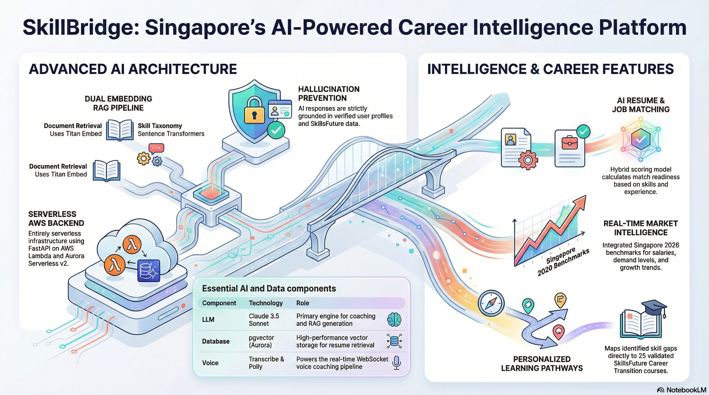

# SkillBridge

**AI-Powered Career Intelligence Platform for Singapore's SCTP Learners & Career Switchers**

SkillBridge is a serverless, full-stack AI platform that helps SCTP learners and mid-career professionals navigate Singapore's evolving tech job market. It combines a Retrieval-Augmented Generation (RAG) pipeline, hybrid skill matching, and an interactive AI career coach — all grounded in real SkillsFuture course data, SSG salary benchmarks, and live market intelligence.



**Enterprise Roadmap:** See [Enterprise-Technical_Roadmap.md](Enterprise-Technical_Roadmap.md)

---

## Table of Contents

1. [Architecture Overview](#architecture-overview)
2. [Technology Stack](#technology-stack)
3. [AI & RAG Pipeline](#ai--rag-pipeline)
4. [EventBridge Automation Layer](#eventbridge-automation-layer)
5. [Features](#features)
6. [Deployment](#deployment)
7. [Local Development](#local-development)
8. [API Reference](#api-reference)
9. [Security](#security)
10. [Cost Model](#cost-model)
11. [Future Improvements](#future-improvements)
12. [Project Structure](#project-structure)

---

## Architecture Overview

SkillBridge is deployed entirely on AWS serverless infrastructure. The backend is a **containerized NestJS application** running on AWS Lambda via the `aws-serverless-express` adapter, exposed through API Gateway HTTP API v2. A separate WebSocket API handles the real-time voice coaching pipeline. An **EventBridge Scheduler automation layer** handles all background processing — cache warming, Lambda keep-alive, and AI pre-computation — without any always-on infrastructure.

```
┌──────────────────────────────────────────────────────────────────┐
│                           FRONTEND                               │
│           Next.js 16 (Static Export) — S3 + CloudFront           │
└───────────────────────────┬──────────────────────────────────────┘
                            │ HTTPS
           ┌────────────────┴────────────────┐
           │   API Gateway HTTP API (v2)     │    API Gateway WebSocket
           │         ANY /{proxy+}           │    $connect / $default / $disconnect
           └────────────────┬────────────────┘           │
                            │                            │
           ┌────────────────▼────────────────┐    ┌──────▼───────────────┐
           │  Lambda: skillbridge-{env}-api  │    │ Lambda: voice        │
           │  NestJS + aws-serverless-express│    │ Polly + Transcribe   │
           │  3008 MB · 120s timeout         │    │ WebSocket push       │
           └────┬──────────┬────────────┬───┘    └──────────────────────┘
                │          │            │
    ┌───────────▼─┐  ┌─────▼─────┐  ┌──▼───────────────────────────────┐
    │  RDS        │  │ AWS       │  │  Dedicated Lambda Functions       │
    │  PostgreSQL │  │ Bedrock   │  │  rag-query · embed-gen            │
    │  + MikroORM │  │ Claude /  │  │  gap-analysis · resume-upload     │
    │  + pgvector │  │ Gemini    │  │  (same ECR image, diff CMD)       │
    └───────────┬─┘  └─────┬─────┘  └──────────────────────────────────┘
                │          │
    ┌───────────▼──────────▼──────────────────────────────────────────┐
    │                    VPC (Private Subnets)                        │
    │  DB Credentials → AWS Secrets Manager                          │
    │  Container Images → Amazon ECR                                 │
    └─────────────────────────────────────────────────────────────────┘

┌──────────────────────────────────────────────────────────────────┐
│                  EventBridge Automation Layer                    │
│  Scheduler → 6 Automation Lambdas → NestJS /internal/* endpoints │
│  SSG sync · Cache cleanup · Warm-up · Recommendation precompute  │
└──────────────────────────────────────────────────────────────────┘
```

### Request Flow

1. Browser loads the Next.js static site from S3 (optionally served via CloudFront)
2. API calls route through API Gateway HTTP API → Lambda (`skillbridge-{env}-api`)
3. The NestJS handler processes the request, querying RDS PostgreSQL via MikroORM
4. For AI features, the handler calls AWS Bedrock (Claude) or Google Gemini, optionally through the RAG pipeline (Titan embed → pgvector search → generate)
5. For voice sessions, the browser opens a WebSocket → dedicated `voice` Lambda → Transcribe → LLM → Polly pipeline
6. **Scheduled automation**: EventBridge Scheduler triggers lightweight Python Lambdas that invoke internal NestJS endpoints (e.g., SSG cache sync, expired-row cleanup) via Lambda Invoke API — never through the public API Gateway

### Infrastructure Modules (Terraform)

| Module           | Resources                                                                                                   |
| ---------------- | ----------------------------------------------------------------------------------------------------------- |
| `vpc`            | VPC, public/private subnets, NAT Gateway, Internet Gateway, route tables                                    |
| `rds`            | RDS PostgreSQL 16 + pgvector, Secrets Manager secret, subnet group                                          |
| `lambda_backend` | NestJS backend Lambda + 5 specialist Lambdas (same ECR image), IAM role, CloudWatch log groups              |
| `api_gateway`    | HTTP API v2, `ANY /{proxy+}` route, Lambda integration, CORS, throttling                                    |
| `websocket`      | WebSocket API, `$connect`/`$disconnect`/`$default` routes                                                   |
| `s3_frontend`    | S3 bucket, static website configuration                                                                     |
| `ecr`            | ECR repository + lifecycle policy (keep last 5 images)                                                      |
| `iam`            | Backend Lambda role + **automation Lambda role** + **EventBridge scheduler role**                           |
| `eventbridge`    | 6 automation Lambda functions, 8 EventBridge Scheduler rules, SQS DLQ, SNS alert topic, 6 CloudWatch alarms |
| `cloudfront`     | CloudFront distribution with OAC (optional: `enable_cloudfront=true`)                                       |
| `opensearch`     | OpenSearch Serverless for hybrid vector search (optional: `enable_opensearch=true`, ~$26/month)             |
| `sagemaker`      | SageMaker Serverless endpoint for embeddings (optional: `enable_sagemaker=true`)                            |

---

## Technology Stack

### Frontend

| Tool                  | Version         | Role                                              |
| --------------------- | --------------- | ------------------------------------------------- |
| Next.js               | 16 (App Router) | React framework, static export (`output: export`) |
| React                 | 19              | UI runtime                                        |
| TypeScript            | 5               | Type safety                                       |
| Tailwind CSS          | 4               | Utility-first styling (OKLCH color space)         |
| shadcn/ui             | New York style  | Component library                                 |
| Recharts              | latest          | Skill radar charts, market trend charts           |
| Framer Motion         | latest          | Page transitions, animated results                |
| React Hook Form + Zod | latest          | Type-safe form validation                         |
| Axios                 | latest          | API client with JWT auto-attach and refresh       |

### Backend

| Tool                                | Version               | Role                                                     |
| ----------------------------------- | --------------------- | -------------------------------------------------------- |
| NestJS                              | 10                    | Backend framework (modular, decorator-based)             |
| TypeScript                          | 5                     | Runtime language                                         |
| MikroORM                            | 6 (PostgreSQL driver) | ORM with entity mapping and migrations                   |
| aws-serverless-express              | latest                | NestJS → Lambda adapter                                  |
| Passport + JWT                      | latest                | Authentication strategy (HS256, access + refresh tokens) |
| class-validator / class-transformer | latest                | DTO validation                                           |
| ConfigModule                        | NestJS built-in       | Environment variable validation via class-validator      |

### AI / ML

| Tool                                                                                 | Role                                                                          |
| ------------------------------------------------------------------------------------ | ----------------------------------------------------------------------------- |
| **AWS Bedrock — Claude 3.5 Sonnet** (`us.anthropic.claude-3-5-sonnet-20241022-v2:0`) | LLM for career coaching, resume parsing, interview simulation, RAG generation |
| **AWS Bedrock — Titan Embed Text v1** (`amazon.titan-embed-text-v1`)                 | 1536-dim embeddings for RAG pipeline + pgvector storage                       |
| **Google Gemini** (`gemini-2.0-flash`)                                               | Primary chat engine + LLM fallback                                            |
| **pgvector**                                                                         | PostgreSQL extension for RAG document retrieval (`<->` cosine distance)       |
| **AWS Polly**                                                                        | Neural TTS (voice: Matthew) for voice coaching responses                      |
| **AWS Transcribe**                                                                   | Batch speech-to-text for voice coaching input                                 |

### Infrastructure & Automation

| Service                   | Role                                                                           |
| ------------------------- | ------------------------------------------------------------------------------ |
| AWS Lambda                | Compute — NestJS backend + 5 specialist functions + **6 automation functions** |
| API Gateway HTTP API v2   | REST interface (29s timeout, proxy integration)                                |
| API Gateway WebSocket API | Real-time voice coaching                                                       |
| RDS PostgreSQL 16         | Managed PostgreSQL + pgvector (db.t4g.micro)                                   |
| **EventBridge Scheduler** | **Cron/rate-based scheduling for all automation tasks**                        |
| **SQS (DLQ)**             | **Dead Letter Queue for failed automation tasks (14-day retention)**           |
| **SNS**                   | **CloudWatch alarm notification topic**                                        |
| Amazon ECR                | Container image registry (lifecycle: keep last 5)                              |
| Amazon S3                 | Frontend static hosting + voice audio temp storage                             |
| CloudFront                | CDN with OAC (optional)                                                        |
| AWS Secrets Manager       | DB credentials + internal automation token                                     |
| Amazon Polly              | Neural TTS                                                                     |
| Amazon Transcribe         | Batch STT                                                                      |

### DevOps

| Tool           | Role                                                                        |
| -------------- | --------------------------------------------------------------------------- |
| Terraform 1.9  | Infrastructure as Code (13 modules)                                         |
| GitHub Actions | CI/CD (manual `workflow_dispatch` only)                                     |
| Docker Buildx  | Multi-platform image build (`linux/amd64`, `--provenance=false` for Lambda) |
| Docker Compose | Local full-stack environment                                                |

---

## AI & RAG Pipeline

### Architecture

SkillBridge uses AWS Bedrock (Titan Embed) for cloud-native 1536-dim vector embeddings stored in RDS pgvector:

```
Resume / Query Text
        │
        └──► Titan Embed Text v1 (1536-dim) ──► pgvector (RDS PostgreSQL)
             via AWS Bedrock                         └─► RAG retrieval
```

### RAG Pipeline Flow

```
User Query
     │
     ▼
generate_titan_embedding(query)          ← AWS Bedrock: Titan Embed Text v1
     │  1536-dim vector
     ▼
similarity_search(query_vec, k=5)        ← pgvector: cosine distance (<->)
     │  top-k matching documents         filter by: text_type, profile_id
     ▼
Build context string from results
     │  + source_text from each hit
     ▼
IntelligenceService → Bedrock / Gemini   ← Structured system prompt
     │  max_tokens=1024                      with grounding instructions
     ▼
Response + source embedding IDs          ← Source tracking for attribution
```

**Stored document types (`text_type`):**

- `"resume"` — extracted resume text (ingested via S3 trigger or upload endpoint)
- `"query"` — past user queries (enables personalized retrieval)
- `"jd"` — job description text

### Hallucination Prevention

**1. Retrieval-Grounded Context Injection** — The system prompt instructs the model to base answers on retrieved documents only, and to admit uncertainty rather than speculate.

**2. Structured Profile Context** — Every chat request injects the user's verified data: full profile (skills, experience, education), top 3 recommended roles with match scores, key skill gaps, SCTP learning pathways, and live Singapore market insights.

**3. Source Attribution** — Every RAG response returns `sources: [embedding_ids]`, enabling full traceability.

### Lambda Functions

All Lambda functions (backend + specialists + automation) share a single ECR container image. Handler selection is via CMD override:

#### Backend & Specialist Lambdas

| Function                     | Handler                                 | Timeout | Memory  | Purpose                           |
| ---------------------------- | --------------------------------------- | ------- | ------- | --------------------------------- |
| `{env}-backend`              | `lambda_handler.handler`                | 120s    | 3008 MB | NestJS app (all HTTP routes)      |
| `{env}-rag-query`            | `lambdas.rag_query_handler.handler`     | 30s     | 3008 MB | Direct RAG query invocation       |
| `{env}-embed-gen`            | `lambdas.embedding_generator.handler`   | 30s     | 3008 MB | Store embeddings in pgvector      |
| `{env}-gap-analysis`         | `lambdas.gap_analysis_handler.handler`  | 60s     | 3008 MB | Skill gap computation via Bedrock |
| `{env}-resume-upload`        | `lambdas.resume_upload_handler.handler` | 30s     | 3008 MB | S3-triggered resume processing    |
| `{env}-bedrock-orchestrator` | `lambdas.bedrock_orchestrator.handler`  | 60s     | 3008 MB | Generic Bedrock model invocation  |

> The 3008 MB allocation is required to load NestJS + all dependencies at Lambda cold start.

#### Automation Lambdas (EventBridge Layer)

| Function                       | Handler                                             | Memory | Timeout | Schedule                  |
| ------------------------------ | --------------------------------------------------- | ------ | ------- | ------------------------- |
| `{env}-ssg-sync`               | `lambdas.automation.ssg_sync.handler`               | 256 MB | 300s    | `cron(0 1 * * ? *)` daily |
| `{env}-cache-cleanup`          | `lambdas.automation.cache_cleanup.handler`          | 128 MB | 60s     | `cron(0 3 * * ? *)` daily |
| `{env}-recommendation-refresh` | `lambdas.automation.recommendation_refresh.handler` | 512 MB | 600s    | `cron(0 2 * * ? *)` daily |
| `{env}-embedding-backfill`     | `lambdas.automation.embedding_backfill.handler`     | 512 MB | 600s    | `rate(6 hours)`           |
| `{env}-market-insights`        | `lambdas.automation.market_insights.handler`        | 256 MB | 120s    | `cron(0 4 * * ? *)` daily |
| `{env}-warmup`                 | `lambdas.automation.lambda_warmup.handler`          | 128 MB | 30s     | `rate(5 minutes)`         |

### Voice Coaching Pipeline

```
Client (browser/app)
     │  binary audio frame over WebSocket
     ▼
API Gateway WebSocket → Lambda (voice handler)
     │
     ├──► S3 upload (audio file, temp storage)
     │
     ├──► AWS Transcribe (batch job, poll up to 25s)
     │         └─► transcript string
     │
     ├──► IntelligenceService (career coaching with profile context)
     │         └─► coaching response text
     │
     └──► AWS Polly (neural TTS, voice: Matthew)
              └─► MP3 bytes (base64-encoded)
                       │
                       ▼
              WebSocket response to client:
              { transcript, response_text, audio_base64, audio_format }
```

---

## EventBridge Automation Layer

The automation layer handles all background processing on a schedule, eliminating cold-cache misses, Lambda cold starts, and on-demand AI computation costs.

### How It Works

```
EventBridge Scheduler (cron/rate rules)
        ↓
Automation Lambda (Python, 128–512 MB)
        ↓  Lambda Invoke API (not API Gateway)
        ↓  X-Internal-Token header
NestJS Backend Lambda (/internal/... endpoints)
        ↓
RDS PostgreSQL · Gemini API · AWS Bedrock
```

**Key design decision:** Automation Lambdas invoke the NestJS backend via the **Lambda Invoke API** (not through API Gateway), so all `/internal/...` endpoints are completely off the public internet.

### Automation Schedule

| Rule                        | Lambda                   | Schedule (UTC)               | What It Does                                           |
| --------------------------- | ------------------------ | ---------------------------- | ------------------------------------------------------ |
| SSG course sync             | `ssg-sync`               | `cron(0 1 * * ? *)` — 01:00  | Pre-warm SSG course cache (10 keywords × 50 courses)   |
| SSG job role sync           | `ssg-sync`               | `cron(30 1 * * ? *)` — 01:30 | Pre-warm job role cache (6 sectors)                    |
| Recommendation precompute   | `recommendation-refresh` | `cron(0 2 * * ? *)` — 02:00  | Score all profiles against all roles                   |
| LLM rationale pre-gen       | `recommendation-refresh` | `cron(30 2 * * ? *)` — 02:30 | Generate Gemini rationale for top-3 matches            |
| Expired cache cleanup       | `cache-cleanup`          | `cron(0 3 * * ? *)` — 03:00  | Bulk DELETE expired `ssg_cache` rows                   |
| Market insights aggregation | `market-insights`        | `cron(0 4 * * ? *)` — 04:00  | Pre-compute market insights for all tenants            |
| Embedding backfill          | `embedding-backfill`     | `rate(6 hours)`              | Generate Titan embeddings for profiles without vectors |
| Lambda warm-up ping         | `warmup`                 | `rate(5 minutes)`            | `GET /internal/health` to prevent NestJS cold starts   |

### Internal Endpoints (`/internal/...`)

All automation targets are protected by `InternalTokenGuard` (shared secret: `X-Internal-Token`):

| Endpoint                                          | Guard                | Status     |
| ------------------------------------------------- | -------------------- | ---------- |
| `GET /internal/health`                            | None                 | ✅ Live    |
| `POST /internal/sync/ssg/courses`                 | `InternalTokenGuard` | ✅ Live    |
| `POST /internal/sync/ssg/jobroles`                | `InternalTokenGuard` | ✅ Live    |
| `POST /internal/cache/cleanup`                    | `InternalTokenGuard` | ✅ Live    |
| `POST /internal/analytics/aggregate`              | `InternalTokenGuard` | ✅ Live    |
| `POST /internal/recommendations/precompute`       | `InternalTokenGuard` | 🔄 Phase 2 |
| `POST /internal/recommendations/rationale-pregen` | `InternalTokenGuard` | 🔄 Phase 2 |
| `POST /internal/embeddings/backfill`              | `InternalTokenGuard` | 🔄 Phase 2 |

### Fault Tolerance

- **Retry policy:** 3 retries with exponential backoff per rule (configurable per schedule)
- **Dead Letter Queue:** All failed tasks land in `skillbridge-{env}-automation-dlq` (SQS, 14-day retention)
- **CloudWatch Alarms:** 6 alarms monitoring DLQ depth, warmup latency, sync errors, and cleanup activity
- **SNS alerts:** Email notification when any alarm fires

### Performance Impact

| Metric                         | Before Automation           | After Automation           |
| ------------------------------ | --------------------------- | -------------------------- |
| SSG course search (cold cache) | ~500ms live API call        | ~50ms cache hit            |
| NestJS Lambda cold start       | 3–5s                        | <500ms (kept warm)         |
| Recommendation API             | 3+ Gemini calls per request | 0 LLM calls (pre-computed) |
| `ssg_cache` table growth       | Unbounded                   | Bounded (nightly cleanup)  |

---

## Features

### Resume Intelligence

- **AI Resume Parsing** — PDF/DOCX/TXT upload (10 MB limit) processed by the `IntelligenceService` via Bedrock or Gemini; returns structured analysis: skills list, readiness score (0–100), strengths, missing skills, suggested roles, recommended courses
- **Embedding Storage** — Resume text is embedded via Titan Embed and stored in pgvector for RAG retrieval
- **S3-triggered ingestion** — Resume uploads to S3 automatically trigger the `resume-upload` Lambda

### Job Matching

- **Hybrid Scoring** — `0.55 × content_similarity + 0.25 × rule_match + 0.20 × career_switcher_bonus`
- **Role database** — 50 job roles with SGD salary benchmarks, required skills, and experience thresholds
- **JD Match** — Paste any job description; get match score, matched skills, missing skills, and a severity-ranked gap table

### Skill Gap Analysis

- **Per-Role Gaps** — Severity-ranked gap items (`high` / `medium` / `none`) for each recommended role
- **Dashboard Radar Chart** — Recharts radar chart showing skill breadth across domains

### AI Career Coach

- **Context-Aware Chat** — The LLM knows your full profile, skill gaps, SCTP courses, and live Singapore market data
- **LLM dispatch:** Gemini API (primary) → AWS Bedrock Claude 3.5 Sonnet (fallback) → HTTP 503. `POST /api/chat` returns `text/event-stream` SSE; parse lines filtering `[ENGINE:*]` prefixes
- **Multi-turn conversation** — Full message history sent on every request; persistent across page navigation
- **RAG-Augmented Responses** — Career coach draws from stored resume embeddings via the RAG pipeline

### Mock Interview Simulator

- **Role-specific questions** generated by Bedrock Claude, targeting your identified skill gaps
- **Configurable difficulty** — `beginner`, `intermediate`, `advanced`
- **Multi-turn session** — Tracks question number and conversation history

### Voice Coaching

- **Real-time WebSocket session** — Low-latency audio-in, audio-out over `wss://`
- **AWS Transcribe** for speech-to-text, **AWS Polly** (neural, Matthew voice) for text-to-speech

### Learning & Pathways (SSG Integration)

- **Live SSG API integration** — Three-tier fallback: SSG live API → PostgreSQL cache → seeded data
- **SCTP Course Database** — 25 validated SkillsFuture Career Transition Programme courses
- **Subsidy Calculator** — MCES (90% for age 40+), SkillsFuture Credit ($500), Training Allowance computed per course
- **Learning Pathways** — Skill → Beginner course → Advanced course, scoped to your specific gaps
- **Pre-warmed cache** — EventBridge syncs the SSG cache nightly at 09:00 SGT so first users never wait

### Market Intelligence

- **Singapore 2026 Benchmarks** — 6 role categories (Data & Analytics, Software Engineering, Cloud & DevOps, AI/ML, Cybersecurity, Product) with avg SGD salary, YoY growth %, and demand level
- **Pre-aggregated insights** — EventBridge aggregates market data nightly so the dashboard loads instantly
- **Peer Comparison** — Anonymized cohort benchmarking against users with similar profiles

### Progress & Portfolio

- **ProfileSnapshot model** — Point-in-time records of skills count, gap count, readiness score for historical tracking
- **Project Suggestions** — LLM-generated portfolio project ideas scoped to your gap skills
- **Resume Rewriter** — Rewrites resume bullet points for target role impact

---

## Deployment

### Prerequisites

1. **AWS account** with IAM permissions for: Lambda, EventBridge Scheduler, API Gateway, ECR, RDS, S3, Bedrock, Polly, Transcribe, Secrets Manager, SQS, SNS, CloudWatch, VPC, IAM

2. **Enable Bedrock model access** (one-time manual step):
   - Open [AWS Bedrock → Model access](https://console.aws.amazon.com/bedrock/home#/modelaccess)
   - Request **Anthropic → Claude 3.5 Sonnet v2** and **Amazon → Titan Embeddings Text v1**
   - Without this step, all Bedrock calls return `ValidationException: Operation not allowed`

3. **Use the cross-region inference profile ID** (not the direct model ID):

   ```
   # Correct
   BEDROCK_MODEL_ID=us.anthropic.claude-3-5-sonnet-20241022-v2:0

   # Wrong (returns Operation not allowed)
   BEDROCK_MODEL_ID=anthropic.claude-3-5-sonnet-20241022-v2:0
   ```

4. **GitHub repository secrets** (Settings → Secrets → Actions, environment: `dev`):

   | Secret                      | Value                                                                                              |
   | --------------------------- | -------------------------------------------------------------------------------------------------- |
   | `AWS_ACCESS_KEY_ID`         | IAM user access key                                                                                |
   | `AWS_SECRET_ACCESS_KEY`     | IAM user secret key                                                                                |
   | `DB_PASSWORD`               | RDS master password (alphanumeric only)                                                            |
   | `SECRET_KEY`                | JWT signing secret (`openssl rand -hex 32`)                                                        |
   | `GEMINI_API_KEY`            | Google AI Studio API key (primary LLM)                                                             |
   | `INTERNAL_AUTOMATION_TOKEN` | EventBridge automation shared secret (`python3 -c "import secrets; print(secrets.token_hex(32))"`) |

### Manual Deployment

```bash
# Generate secrets
export TF_VAR_db_password="$(openssl rand -hex 24)"
export TF_VAR_secret_key="$(openssl rand -hex 32)"
export TF_VAR_internal_automation_token="$(python3 -c 'import secrets; print(secrets.token_hex(32))')"

# Full deploy (ECR → Docker build → Terraform → S3 sync → EventBridge verify)
bash scripts/deploy-serverless.sh dev

# Step-by-step Terraform
cd terraform
terraform init
terraform apply \
  -var="lambda_image_uri=<ecr_url>:latest" \
  -var="internal_automation_token=${TF_VAR_internal_automation_token}"
```

### GitHub Actions (CI/CD)

The workflow supports these `workflow_dispatch` inputs:

| Input                  | Default | Description                                                   |
| ---------------------- | ------- | ------------------------------------------------------------- |
| `environment`          | `dev`   | Target environment (`dev` / `prod`)                           |
| `skip_terraform`       | `false` | `true` = push image + update Lambda only (~5 min, URLs preserved) |
| `enable_cloudfront`    | `true`  | CloudFront CDN + HTTPS (set `false` for S3-only HTTP)         |
| `enable_custom_domain` | `false` | Enable Route 53 + ACM certificate for `custom_domain`         |
| `custom_domain`        | —       | Apex domain (e.g. `sklbr.co`)                                 |

```bash
# Quick redeploy — code only, Terraform skipped (~5 min, URLs preserved)
gh workflow run deploy-serverless.yml -f environment=dev -f skip_terraform=true

# Full deploy with custom domain + CloudFront + HTTPS
gh workflow run deploy-serverless.yml \
  -f environment=dev \
  -f enable_cloudfront=true \
  -f enable_custom_domain=true \
  -f custom_domain=sklbr.co

# Custom domain without CloudFront — HTTP only (S3 website endpoint)
gh workflow run deploy-serverless.yml \
  -f environment=dev \
  -f enable_cloudfront=false \
  -f enable_custom_domain=true \
  -f custom_domain=sklbr.co
```

> **Custom domain DNS note:** After the first deploy, Route 53 creates a hosted zone. You must update your domain registrar's nameservers to match the 4 NS records in that hosted zone. Run `aws route53 list-hosted-zones` and look up the NS records for your domain. Without this step the domain will not resolve.

> **HTTPS requires CloudFront.** S3 static website endpoints serve HTTP only. For production, set `enable_cloudfront=true`.

### Verify EventBridge Automation After Deploy

```bash
# List active schedules
aws scheduler list-schedules --region us-east-1

# Manual smoke test — cache cleanup
aws lambda invoke \
  --function-name skillbridge-dev-cache-cleanup \
  --payload '{"task":"cleanup_ssg_cache","endpoint":"/internal/cache/cleanup","method":"POST"}' \
  --cli-binary-format raw-in-base64-out \
  /tmp/out.json && cat /tmp/out.json

# Tail automation logs
aws logs tail /aws/lambda/skillbridge-dev-ssg-sync --since 1h
aws logs tail /aws/lambda/skillbridge-dev-warmup --since 30m
```

### Cost Management

```bash
# Pause between demos — destroy NAT Gateway ($32/month saving)
terraform destroy \
  -target='module.vpc.aws_nat_gateway.main' \
  -target='module.vpc.aws_eip.nat'

# Disable EventBridge warm-up pings when stack is idle
# Set enable_warmup = false in terraform.tfvars, then:
terraform apply -target=module.eventbridge

# Destroy only the automation layer (keep app running)
terraform destroy \
  -target=module.eventbridge \
  -target=aws_secretsmanager_secret.internal_token
```

---

## Local Development

### Quick Start (Docker Compose)

```bash
git clone https://github.com/azniosman/dsai-capstone.git
cd dsai-capstone
cp nestjs-backend/.env.example nestjs-backend/.env  # fill in secrets
docker compose up -d --build
```

| Service                  | URL                       |
| ------------------------ | ------------------------- |
| Frontend                 | http://localhost:3000     |
| NestJS Backend + Swagger | http://localhost:8000/api |
| PostgreSQL               | localhost:5432            |

### Backend (NestJS standalone)

```bash
cd nestjs-backend
npm install
npm run start:dev          # http://localhost:8000 (hot reload)
npm run build              # production build
npx tsc --noEmit           # type-check only (no output)
```

### Frontend (standalone)

```bash
cd frontend
npm install
npm run dev        # http://localhost:3000 (hot reload)
npm run lint       # ESLint check
npm run build      # production static export
```

### Environment Variables

```ini
# ── Database ────────────────────────────────────────────────────
DATABASE_HOST=localhost
DATABASE_PORT=5432
DATABASE_USER=skillbridge
DATABASE_PASSWORD=changeme
DATABASE_NAME=skillbridge

# ── Security ────────────────────────────────────────────────────
JWT_SECRET=your_64_char_hex_secret_here

# ── AI — Primary (Google Gemini) ────────────────────────────────
GEMINI_API_KEY=AIzaSy...
GEMINI_MODEL=gemini-2.0-flash

# ── AI — Fallback (AWS Bedrock) ─────────────────────────────────
AWS_REGION=us-east-1
BEDROCK_MODEL_ID=us.anthropic.claude-3-5-sonnet-20241022-v2:0
# ^ Must use cross-region inference profile ID (us.anthropic…)
# ^ Requires model access enabled in AWS Bedrock console

# ── SSG / SkillsFuture API (optional) ───────────────────────────
SSG_CLIENT_ID=
SSG_CLIENT_SECRET=
SSG_API_BASE_URL=https://public-api.ssg-wsg.gov.sg
SSG_TOKEN_URL=https://public-api.ssg-wsg.gov.sg/oauth/token
SSG_CACHE_TTL_SECONDS=86400

# ── Internal Automation (EventBridge Lambda-to-Lambda) ──────────
# Generate: python3 -c "import secrets; print(secrets.token_hex(32))"
INTERNAL_AUTOMATION_TOKEN=change-me-in-production

# ── CORS ────────────────────────────────────────────────────────
# JSON array of allowed origins; comma-separated also accepted
CORS_ALLOWED_ORIGINS=["http://localhost:3000","http://localhost:5173"]

# ── Frontend (build-time) ───────────────────────────────────────
NEXT_PUBLIC_API_URL=http://localhost:8000
NEXT_OUTPUT=export                      # set for static S3 export
```

---

## API Reference

All public endpoints are prefixed `/api`. Internal automation endpoints (`/internal/*`) are only accessible via Lambda Invoke API.

### Authentication

| Method | Path                 | Description                                                                |
| ------ | -------------------- | -------------------------------------------------------------------------- |
| `POST` | `/api/auth/register` | Register — JSON body: `{email, password, name}`                                                                                          |
| `POST` | `/api/auth/login`    | Login — `application/x-www-form-urlencoded` body: `username=<email>&password=<password>`; returns `{access_token, refresh_token}` |
| `GET`  | `/api/auth/me`       | Current user — requires Bearer token                                       |

### Profile & Resume

| Method | Path                  | Description                                               |
| ------ | --------------------- | --------------------------------------------------------- |
| `POST` | `/api/profile`        | Create/update profile                                     |
| `GET`  | `/api/profile/me`     | Fetch authenticated user's profile                        |
| `POST` | `/api/upload-resume`  | Upload PDF/DOCX (multipart) — returns structured analysis |
| `POST` | `/api/jd-match`       | Match profile against a job description                   |

### AI Features

| Method | Path                               | Description                                                             |
| ------ | ---------------------------------- | ----------------------------------------------------------------------- |
| `POST` | `/api/chat`                        | Career coach — body: `{profile_id?, messages}`; response: SSE stream    |
| `POST` | `/api/interview`                   | Mock interview — body: `{profile_id, role_title, messages, difficulty}` |
| `POST` | `/api/recommend`                   | Hybrid job recommendations                                              |
| `GET`  | `/api/skill-gap/:profileId`        | Per-role skill gap analysis                                             |
| `POST` | `/api/resume-rewriter`             | Rewrite a resume bullet point                                           |
| `GET`  | `/api/project-suggestions/:profileId` | Portfolio project ideas                                              |
| `POST` | `/api/gap-analysis`                | Async skill gap analysis                                                |
| `POST` | `/api/rag/query`                   | RAG-based document retrieval                                            |
| `GET`  | `/api/dashboard/summary`           | Authenticated user's dashboard KPIs                                     |

### Upskilling & Courses

| Method | Path                                     | Description                                    |
| ------ | ---------------------------------------- | ---------------------------------------------- |
| `GET`  | `/api/upskilling/:profileId`             | Personalized upskilling roadmap                |
| `GET`  | `/api/ssg/courses/search?keyword=python` | Search SSG courses (pre-warmed by EventBridge) |
| `GET`  | `/api/ssg/courses/:ref`                  | Single SSG course by reference number          |
| `GET`  | `/api/ssg/job-roles?sector=ICT`          | SSG Skills Framework job roles                 |
| `POST` | `/api/ssg/recommendations`               | Personalised SSG course recommendations        |
| `GET`  | `/api/courses`                           | SCTP courses with fee, subsidy, nett payable   |
| `POST` | `/api/calculate-subsidy`                 | Calculate MCES/SFC subsidy for a course        |

### Market & Roles

| Method | Path                          | Description                                          |
| ------ | ----------------------------- | ---------------------------------------------------- |
| `GET`  | `/api/market-insights` | Singapore 2026 salary + demand data (pre-aggregated) |
| `GET`  | `/api/roles`                  | All job roles with SGD salary benchmarks             |

### Skills & Progress

| Method | Path                                       | Description                      |
| ------ | ------------------------------------------ | -------------------------------- |
| `POST` | `/api/progress`                     | Record skill progress checkpoint |
| `GET`  | `/api/progress/:profileId`          | Progress dashboard data          |
| `GET`  | `/api/progress/:profileId/timeline` | Progress timeline for charting   |

### Internal Automation (Lambda Invoke only — not via API Gateway)

| Method | Path                                         | Guard                | Description                         |
| ------ | -------------------------------------------- | -------------------- | ----------------------------------- |
| `GET`  | `/internal/health`                           | None                 | Lambda warm-up health check         |
| `POST` | `/internal/sync/ssg/courses`                 | `InternalTokenGuard` | Pre-warm SSG course cache           |
| `POST` | `/internal/sync/ssg/jobroles`                | `InternalTokenGuard` | Pre-warm job role cache             |
| `POST` | `/internal/cache/cleanup`                    | `InternalTokenGuard` | Purge expired `ssg_cache` rows      |
| `POST` | `/internal/recommendations/precompute`       | `InternalTokenGuard` | Pre-compute recommendation scores   |
| `POST` | `/internal/recommendations/rationale-pregen` | `InternalTokenGuard` | Pre-generate LLM rationale          |
| `POST` | `/internal/embeddings/backfill`              | `InternalTokenGuard` | Generate missing profile embeddings |
| `POST` | `/internal/analytics/aggregate`              | `InternalTokenGuard` | Pre-compute market insights         |

### System

| Method | Path      | Description                                        |
| ------ | --------- | -------------------------------------------------- |
| `GET`  | `/health` | Health check — `{"status":"ok","timestamp":"..."}` |

---

## Security

### Authentication & Authorization

- **JWT tokens** (Passport/JWT, HS256): 15-minute access tokens + 7-day refresh tokens
- **Guards:** `JwtAuthGuard` on protected routes; `OptionalJwtAuthGuard` for public routes that optionally scope to a user
- **Password hashing:** bcrypt via Passport local strategy
- **IDOR protection:** All profile endpoints filter by `user_id` on authenticated requests

### Multi-tenancy

- Every MikroORM entity includes a `tenant` relation (FK to `Tenant` entity)
- All queries filter by `tenantId`; a `Global` tenant covers unauthenticated flows

### Infrastructure

- **Private subnets:** NestJS Lambda and RDS run in VPC private subnets with no direct internet ingress
- **Secrets Manager:** RDS credentials and the internal automation token are never in Lambda environment variables — fetched at startup
- **IAM least privilege:**
  - Backend Lambda: Bedrock, Transcribe, Polly, specific S3 buckets, Secrets Manager
  - Automation Lambda: only Lambda Invoke (backend), Secrets Manager (token), CloudWatch, SQS DLQ
  - EventBridge Scheduler: only Lambda Invoke (automation functions)
- **Internal endpoint protection:** `/internal/*` routes require `X-Internal-Token` header; API Gateway never routes to these paths — only Lambda Invoke API can reach them

### Frontend

- **Next.js middleware:** CSP, X-Frame-Options, Permissions-Policy headers on every response
- **Token refresh:** shared Promise prevents race conditions when multiple concurrent requests trigger a 401

---

## Cost Model

| Resource                   | Monthly Cost   | Notes                                                 |
| -------------------------- | -------------- | ----------------------------------------------------- |
| RDS db.t4g.micro           | ~$13           | PostgreSQL 16 + pgvector                              |
| NAT Gateway                | ~$32           | Required for Lambda → internet; destroy between demos |
| Lambda (all functions)     | ~$0–2          | Pay-per-invocation (backend + automation, free tier)  |
| **EventBridge Automation** | **~$3.40**     | Scheduler + custom metrics + Secrets Manager + alarms |
| S3 + CloudFront            | ~$1–5          | Frontend static hosting                               |
| ECR                        | ~$0.50         | Container image storage                               |
| **Total (with NAT)**       | **~$52/month** |                                                       |
| **Total (paused NAT)**     | **~$20/month** | Pause when not presenting                             |

> **EventBridge cost breakdown:** Lambda invocations (~$0.50) + CloudWatch metrics/alarms (~$2.40) + Secrets Manager (~$0.44) + EventBridge Scheduler (~$0.00, within free tier). See [COST_OPTIMIZATION_PLAN.md](docs/COST_OPTIMIZATION_PLAN.md) for details.

---

## Future Improvements

- **EventBridge Phase 2** — Full implementation of recommendation pre-computation, LLM rationale pre-generation, and embedding backfill endpoints (stubs already wired to EventBridge schedules)
- **OpenSearch integration** — The Terraform `opensearch` module is implemented and togglable (`enable_opensearch=true`). Enables hybrid BM25 + vector search
- **SageMaker embeddings** — `enable_sagemaker=true` moves embedding inference to a dedicated SageMaker Serverless endpoint
- **Bedrock Knowledge Base** — Replace the custom pgvector RAG implementation with a managed Bedrock Knowledge Base
- **CloudFront + WAF** — WAF integration for edge-level rate limiting and layer-7 attack protection
- **OIDC-based CI/CD** — Replace static IAM keys in GitHub Actions with OIDC role assumption
- **Alembic / MikroORM migrations** — Formal schema migration management instead of `onModuleInit` auto-sync
- **Token refresh persistence** — DynamoDB or Redis-backed JTI blacklist (currently in-memory, lost on Lambda restart)
- **EventBridge Phase 3** — Skill progress cleanup (monthly) and weekly digest email notifications

---

## Project Structure

```
dsai-capstone/
├── nestjs-backend/                  # NestJS backend (containerized Lambda)
│   ├── src/
│   │   ├── app.module.ts            # Root module — imports all feature modules
│   │   ├── auth/                    # JWT auth: guards, strategies, DTOs
│   │   ├── users/                   # User entity + CRUD service
│   │   ├── profile/                 # UserProfile entity + service
│   │   ├── skills/                  # Skill progress tracking
│   │   ├── intelligence/            # AI features: chat, recommend, gap analysis,
│   │   │                            # resume parse, mock interview, RAG
│   │   ├── upskilling/              # Upskilling roadmap generation
│   │   ├── roles/                   # Job roles + salary benchmarks
│   │   ├── courses/                 # SCTP course catalog + subsidy calculator
│   │   ├── domain/                  # Market insights + dashboard aggregation
│   │   ├── ssg/                     # SSG/SkillsFuture API integration + cache
│   │   │   ├── ssg.service.ts       # Three-tier fallback: live API → cache → seed
│   │   │   ├── ssg-cache.service.ts # PostgreSQL TTL cache + purgeExpired()
│   │   │   └── ssg-client.service.ts# OAuth2 HTTP client for SSG API
│   │   └── internal/                # EventBridge automation endpoints
│   │       ├── internal.controller.ts  # 8 /internal/* routes
│   │       └── internal.module.ts
│   ├── src/common/
│   │   ├── guards/
│   │   │   └── internal-token.guard.ts  # X-Internal-Token validation
│   │   └── config/
│   │       └── env.validation.ts    # class-validator env schema
│   ├── src/entities/                # MikroORM entities (all tables)
│   └── Dockerfile.lambda            # Multi-stage build for Lambda ECR image
│
├── lambdas/                         # Python Lambda handlers
│   ├── automation/                  # EventBridge automation layer (NEW)
│   │   ├── base_automation.py       # Shared: call_internal_endpoint, emit_metric
│   │   ├── ssg_sync.py
│   │   ├── cache_cleanup.py
│   │   ├── recommendation_refresh.py
│   │   ├── embedding_backfill.py
│   │   ├── market_insights.py
│   │   └── lambda_warmup.py
│   ├── bedrock_orchestrator.py
│   ├── embedding_generator.py
│   ├── gap_analysis_handler.py
│   ├── rag_query_handler.py
│   ├── resume_upload_handler.py
│   └── voice_coaching_handler.py
│
├── frontend/
│   ├── app/                         # Next.js 16 App Router pages
│   ├── components/
│   │   ├── ui/                      # shadcn primitives
│   │   └── layout/                  # AppShell, SidebarNav, PageHeader
│   └── lib/
│       ├── api-client.ts            # Axios instance (JWT auto-attach, refresh)
│       └── api.ts                   # Typed service layer + entity types
│
├── terraform/
│   ├── main.tf                      # 13-module wiring (including EventBridge)
│   ├── variables.tf                 # All input variables
│   ├── outputs.tf                   # api_endpoint, frontend_url, websocket_endpoint
│   └── modules/
│       ├── eventbridge/             # NEW: 6 Lambdas, 8 rules, DLQ, SNS, alarms
│       ├── iam/                     # backend role + automation role + scheduler role
│       ├── vpc/
│       ├── rds/
│       ├── lambda_backend/
│       ├── api_gateway/
│       ├── websocket/
│       ├── s3_frontend/
│       ├── ecr/
│       ├── cloudfront/
│       ├── opensearch/              # Optional
│       └── sagemaker/               # Optional
│
├── scripts/
│   ├── deploy-serverless.sh         # 6-step deploy: ECR → Docker → TF → S3 → CF → EventBridge verify
│   └── build_and_push.sh            # Docker buildx + ECR push
│
├── .github/workflows/
│   └── deploy-serverless.yml        # Manual dispatch CI/CD (workflow_dispatch)
│
└── docker-compose.yml               # Local: postgres/pgvector, nestjs-backend, frontend
```

---

## License

MIT — see `LICENSE`.

---

_SkillBridge — Empowering Singapore's Workforce_
